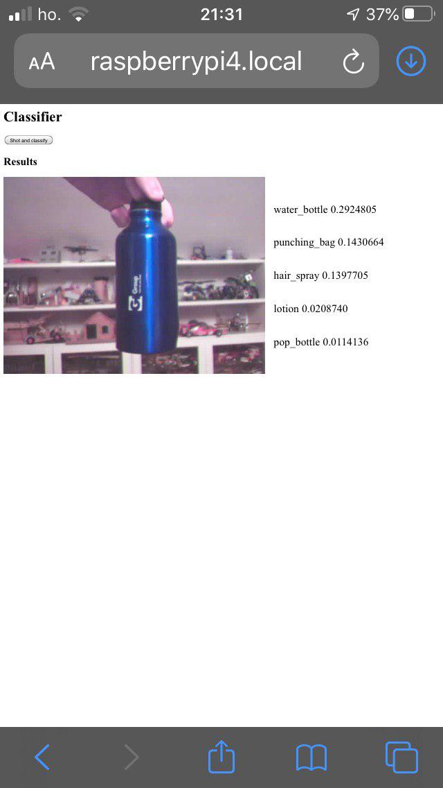

# AI



# Requirements
- openvino
- openCV
- Flask

## Hardware
A webcam is required

It can be useful to have an Intel© *Neural Compute Stick*

## Model

You can download *inception-v4* model from [https://docs.openvinotoolkit.org/latest/_docs_MO_DG_prepare_model_convert_model_Convert_Model_From_TensorFlow.html](https://docs.openvinotoolkit.org/latest/_docs_MO_DG_prepare_model_convert_model_Convert_Model_From_TensorFlow.html)

# Settings
```python
def __init__(self):
      self.model = 'inception-v4.xml'
      self.device = 'MYRIAD'
      self.number_top = 10
      self.input=['input.jpg']
      self.load_model()
```

Change here the device, the model's name or the number of categories to show

# Run
```bash
python server.py
```
